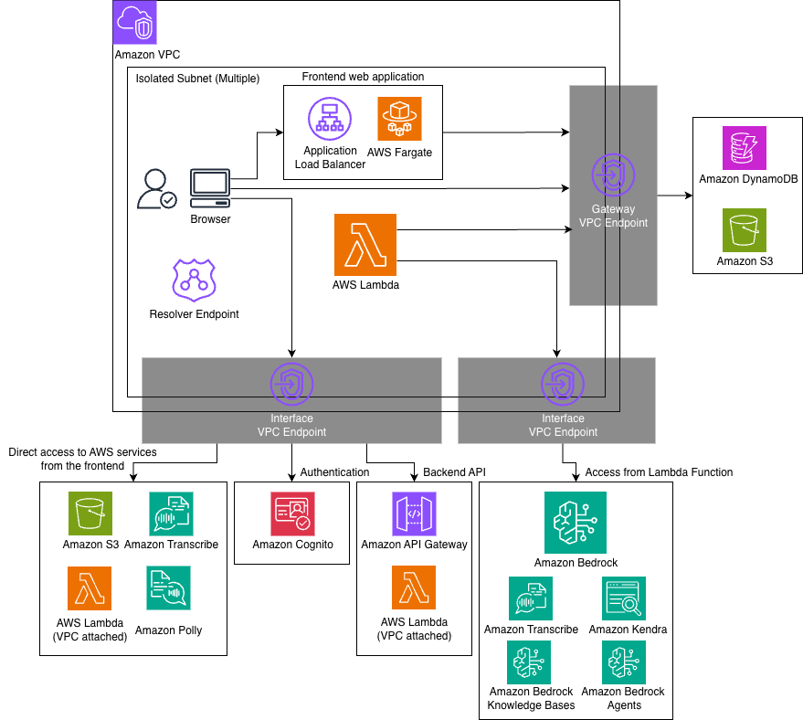

# Closed Network Mode

By setting the `closedNetworkMode` option to true, you can enable communication from clients to GenU through a closed network.
Additionally, communication between AWS Lambda, which is GenU's main computing resource, and other AWS services (such as Amazon DynamoDB, Amazon S3, and Amazon Bedrock) is completed within the VPC. The architectural changes are as follows:

- Amazon CloudFront is not used; web static files are served by Application Load Balancer and ECS Fargate.
- Amazon Cognito is accessed through Amazon API Gateway.
- Communication from Lambda functions to other services is performed via VPC Endpoints.

Options related to closed network mode have the `closedNetwork` prefix. The following is a list of options:

| Parameter                           | Description                                                                                                                                                                                                                                            |
| ----------------------------------- | ------------------------------------------------------------------------------------------------------------------------------------------------------------------------------------------------------------------------------------------------------ |
| closedNetworkMode                   | Whether to enable closed network mode. true enables closed network mode. Default is false.                                                                                                                                                             |
| closedNetworkVpcIpv4Cidr            | IPv4 CIDR to specify when creating a new VPC. Default is 10.0.0.0/16.                                                                                                                                                                                  |
| closedNetworkVpcId                  | VPC ID when importing an existing VPC. If not specified, a new VPC will be created.                                                                                                                                                                    |
| closedNetworkSubnetIds              | Specify multiple Subnet IDs where GenU-related resources will be deployed. ALB, Fargate tasks, VPC Endpoints, and Resolver Endpoints will be created. If not specified, Isolated Subnets will be selected. Specify two or more Subnet IDs in an array. |
| closedNetworkCertificateArn         | ACM ARN to specify when assigning a domain to GenU. ACM must be manually generated. If not specified, GenU will be published with the Application Load Balancer's default endpoint.                                                                    |
| closedNetworkDomainName             | GenU's domain name. Private Hosted Zone is generated by CDK, so manual creation is not required. Both `closedNetworkCertificateArn` and `closedNetworkDomainName` must be specified together or both omitted.                                          |
| closedNetworkCreateTestEnvironment  | Whether to create a test environment. Created by default. Specify false if not needed. The test environment is created as an EC2 Windows instance and accessed via Fleet Manager. (Detailed procedures described later.)                               |
| closedNetworkCreateResolverEndpoint | Whether to generate Route53 Resolver Endpoint. Default is true.                                                                                                                                                                                        |

## Architecture



## Current Limitations

- Deployment must be performed in an environment with internet connectivity. Also, internet connectivity is required when accessing the operation verification environment from the management console.
- Deployment requires the same environment as normal mode deployment. Specifically, AWS IAM user configuration, Node.js, and Docker are needed.
- The region where GenU is deployed and the model region must be the same. Currently, it's not possible to deploy GenU in ap-northeast-1 and use models from us-east-1.
- Since various resources are created, when importing an existing VPC, it's recommended to use as clean an environment as possible.
- SAML integration is not available.
- Voice Chat use case is currently not available.

## Example of Valid Configuration File

Here's an example of a valid parameter.ts. If you're using cdk.json, please adapt accordingly.

```typescript
const envs: Record<string, Partial<StackInput>> = {
  // Deploy with environment name 'priv' (any environment name is fine)
  priv: {
    region: 'ap-northeast-1',
    modelRegion: 'ap-northeast-1',
    modelIds: ['apac.anthropic.claude-sonnet-4-20250514-v1:0'],
    imageGenerationModelIds: ['amazon.nova-canvas-v1:0'],
    videoGenerationModelIds: ['amazon.nova-reel-v1:0'],
    // Voice Chat is not available
    speechToSpeechModelIds: [],
    // Optional settings
    ragEnabled: true,
    ragKnowledgeBaseEnabled: true,
    agentEnabled: true,
    mcpEnabled: true,
    guardrailEnabled: true,
    useCaseBuilderEnabled: true,
    // Closed network options below
    closedNetworkMode: true,
    // The following two are not needed if not setting a domain
    closedNetworkDomainName: 'genu.closed',
    closedNetworkCertificateArn:
      'arn:aws:acm:ap-northeast-1:111111111111:certificate/aaaaaaaa-bbbb-cccc-dddd-eeeeeeeeeeee',
    // When specifying existing VPC and Subnets (the following two are not needed for new creation)
    closedNetworkVpcId: 'vpc-00000000000000000',
    closedNetworkSubnetIds: [
      'subnet-11111111111111111',
      'subnet-22222222222222222',
    ],
  },
};
```

## Deployment Method

After configuring the `closedNetwork...` options, deploy using the normal procedure written in [README.md](/README.md). An additional stack called ClosedNetworkStack\<environment name> will be deployed. (For convenience, \<environment name> will be omitted hereafter.)
The URL for accessing GenU is output in the WebUrl of ClosedNetworkStack. Note that it's not the WebUrl of GenerativeAiUseCasesStack.
Also, GenU cannot be accessed until the deployment of GenerativeAiUseCasesStack is complete.

## Verification Method

This explains the verification method when closedNetworkCreateTestEnvironment is set to true and deployed. Access the Windows EC2 instance via the management console.

### Step 1. Obtain EC2 Key Pair Private Key

Obtain the private key of the Key Pair set in EC2 to connect to the Windows instance via RDP. The command to obtain the private key is displayed in the ClosedNetworkStack output starting with `WindowsRdpGetSSMKeyCommand...`.
It looks like this:

```bash
aws ssm get-parameter --name /ec2/keypair/key-aaaaaaaaaaaaaaaaa --region ap-northeast-1 --with-decryption --query Parameter.Value --output text
```

Please copy the result of executing this command.

### Step 2. Connect to Windows Instance

1. Open the management console and go to [EC2](https://console.aws.amazon.com/ec2/home).
2. Check the instance with a name starting with ClosedNetworkStack... and click "Connect" in the upper right.
3. Select the RDP client tab, choose Connect using Fleet manager, and click Fleet Manager Remote Desktop.
4. Select Key pair for Authentication type, select Paste key pair content for Key pair content, and paste the private key obtained in step 1.
5. Click Connect.

### Step 3. Access GenU

Open the Edge browser within Windows, enter the URL displayed in the WebUrl output of ClosedNetworkStack to access GenU.
SignUp is required on first access.

### About the Verification Instance

The verification instance does not automatically stop, so please manually stop the target instance in EC2 after verification is complete.
Also, if the verification environment itself is not needed, you can delete it by setting closedNetworkCreateTestEnvironment to false and redeploying.

## Setting a Custom Domain for Closed Network GenU

### Obtaining a Certificate

Issue a certificate for the domain you want to set and import it into [AWS Certificate Manager](https://console.aws.amazon.com/acm/home).
Specify the ARN of the created Certificate in closedNetworkCertificateArn and specify the domain in closedNetworkDomainName.

The following procedure is for issuing a self-signed certificate **for verification purposes**, but please do not use this for production. **The browser will display warnings when accessing.**
Use the `openssl` command.

```bash
# Generate a key.
openssl genrsa 2048 > ssl.key

# Specify the domain you will use for Common Name
openssl req -new -key ssl.key > ssl.csr

# Issue valid for 10 years
openssl x509 -days 3650 -req -signkey ssl.key < ssl.csr > ssl.crt
```

Paste the contents of ssl.crt in Certificate body and the contents of ssl.key in Certificate private key, then click the Import certificate button.

## DNS Server Configuration for On-Premises Connection

Here we make two assumptions:

- The route from on-premises to AWS is already established. (This means that by specifying the IP address of the VPC created or imported by ClosedNetworkStack, you can reach the resources beyond it.)
- Route53 Resolver Endpoint has been created. (Resolver Endpoint is created by deploying with closedNetworkCreateResolverEndpoint set to true. This parameter is true by default.)

The endpoints that require name resolution from clients are as follows. Parts enclosed in `<>` need to be replaced with actual values.

| Service Name                | Role                        | Endpoint                                                     | How to Check Endpoint                                                                         |
| --------------------------- | --------------------------- | ------------------------------------------------------------ | --------------------------------------------------------------------------------------------- |
| Application Load Balancer   | Web static file server      | Custom domain or internal-\<aaa>.\<region>.elb.amazonaws.com | Check with WebUrl output of ClosedNetworkStack                                                |
| API Gateway                 | Main API                    | \<xxx>.execute-api.\<region>.amazonaws.com                   | Check with ApiEndpoint output of **GenerativeAiUseCasesStack**                                |
| API Gateway                 | Cognito User Pool proxy     | \<yyy>.execute-api.\<region>.amazonaws.com                   | Check with CognitoPrivateProxyCognitoUserPoolProxyApiEndpoint... output of ClosedNetworkStack |
| API Gateway                 | Cognito Identity Pool proxy | \<zzz>.execute-api.\<region>.amazonaws.com                   | Check with CognitoPrivateProxyCognitoIdPoolProxyApiEndpoint... output of ClosedNetworkStack   |
| Amazon S3                   | Signed URLs                 | s3.\<region>.amazonaws.com                                   | Endpoint is fixed                                                                             |
| AWS Lambda                  | Streaming output            | lambda.\<region>.amazonaws.com                               | Endpoint is fixed                                                                             |
| Amazon Transcribe           | Speech-to-text              | transcribe.\<region>.amazonaws.com                           | Endpoint is fixed                                                                             |
| Amazon Transcribe Streaming | Real-time speech-to-text    | transcribestreaming.\<region>.amazonaws.com                  | Endpoint is fixed                                                                             |
| Amazon Polly                | Text-to-speech              | polly.\<region>.amazonaws.com                                | Endpoint is fixed                                                                             |

Please modify your DNS server configuration to specify the IP address of the Resolver Endpoint as the resolver (forwarder) for all endpoints in the table above.
The IP address of the Resolver Endpoint can be confirmed by opening [Route53](https://console.aws.amazon.com/route53resolver), selecting Inbound endpoints, and clicking on the created endpoint.
Note that except for "when setting a custom domain for Application Load Balancer," all endpoints are amazonaws.com domains. Therefore, the most simplified configuration is to specify the IP address of the Resolver Endpoint as the resolver for amazonaws.com. However, this configuration has a wide scope and large side effects, so it's strongly recommended to configure each endpoint's FQDN individually.

For verification purposes, you can also set the Resolver Endpoint IP as the DNS server on your local machine. However, due to concerns about side effects in this case as well, it's strongly recommended to revert the settings after operation verification.

### When Configuring /etc/hosts for Operation Verification

When configuring the local machine's /etc/hosts, you need the IP addresses of each endpoint rather than the Resolver Endpoint.
However, since these IP addresses may change and you can only specify a single IP address without redundancy, please use this only for operation verification.
The following summarizes the endpoints that need configuration and how to check their IP addresses.

| Service Name                | Role                        | Endpoint                                                     | How to Check IP Address |
| --------------------------- | --------------------------- | ------------------------------------------------------------ | ----------------------- |
| Application Load Balancer   | Web static file server      | Custom domain or internal-\<aaa>.\<region>.elb.amazonaws.com | Method 1                |
| API Gateway                 | Main API                    | \<xxx>.execute-api.\<region>.amazonaws.com                   | Method 2                |
| API Gateway                 | Cognito User Pool proxy     | \<yyy>.execute-api.\<region>.amazonaws.com                   | Method 2                |
| API Gateway                 | Cognito Identity Pool proxy | \<zzz>.execute-api.\<region>.amazonaws.com                   | Method 2                |
| Amazon S3                   | Signed URLs                 | \<S3 bucket name>.s3.\<region>.amazonaws.com                 | Method 2                |
| AWS Lambda                  | Streaming output            | lambda.\<region>.amazonaws.com                               | Method 2                |
| Amazon Transcribe           | Speech-to-text              | transcribe.\<region>.amazonaws.com                           | Method 2                |
| Amazon Transcribe Streaming | Real-time speech-to-text    | transcribestreaming.\<region>.amazonaws.com                  | Method 2                |
| Amazon Polly                | Text-to-speech              | polly.\<region>.amazonaws.com                                | Method 2                |

- Method 1: Open Network Interfaces in [EC2](https://console.aws.amazon.com/ec2/home) and search for "elb". The target ENI is the one with Security group names starting with ClosedNetworkStack.... Click the Network interface ID to see the Private IPv4 address. Since there are multiple, select one of them.
- Method 2: Open Endpoints in [VPC](https://console.aws.amazon.com/vpcconsole/home) and look for the corresponding service name. The service name is the reverse of the endpoint. (However, for API Gateway, the ID is omitted.) Click the VPC endpoint ID to see the deployed Subnets and IP addresses at the bottom of the page. Since there are multiple, select one of them.
