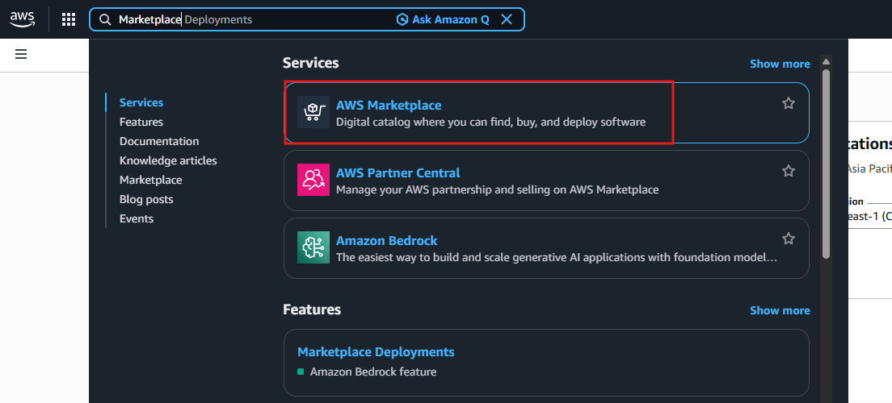
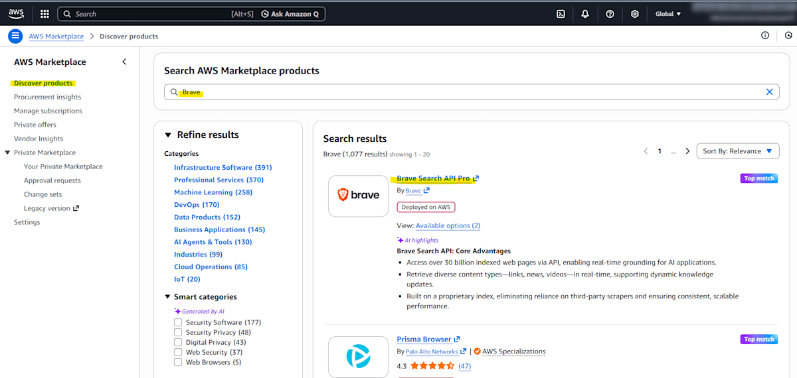
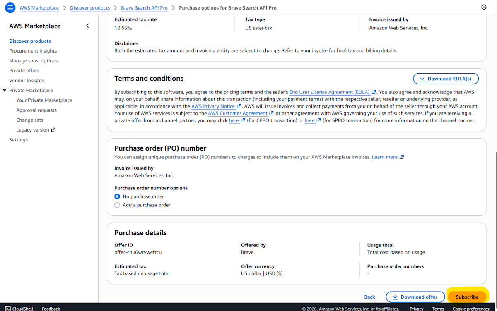
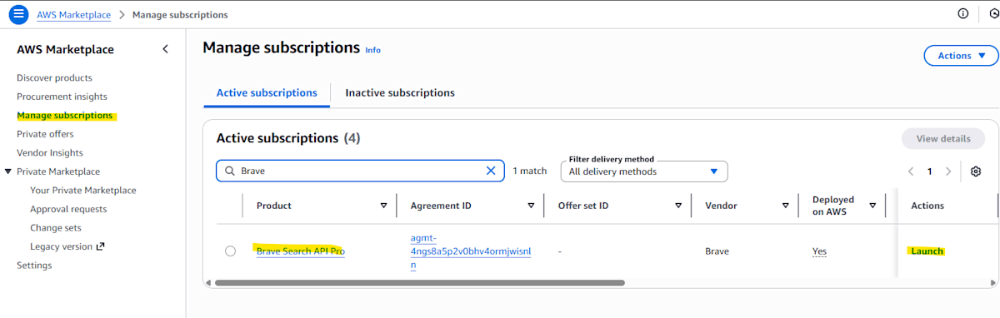
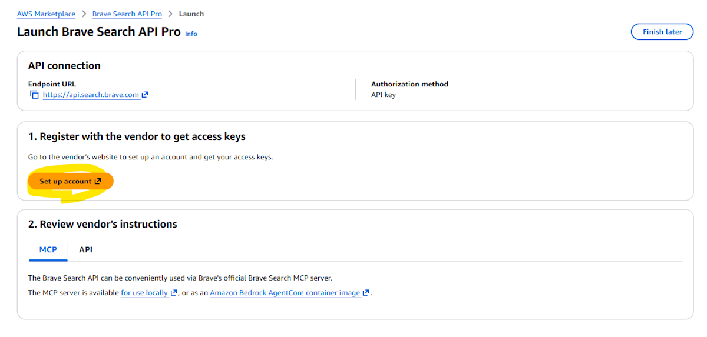
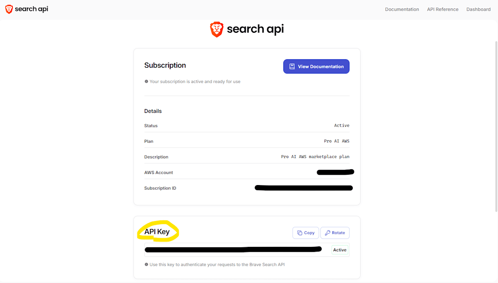
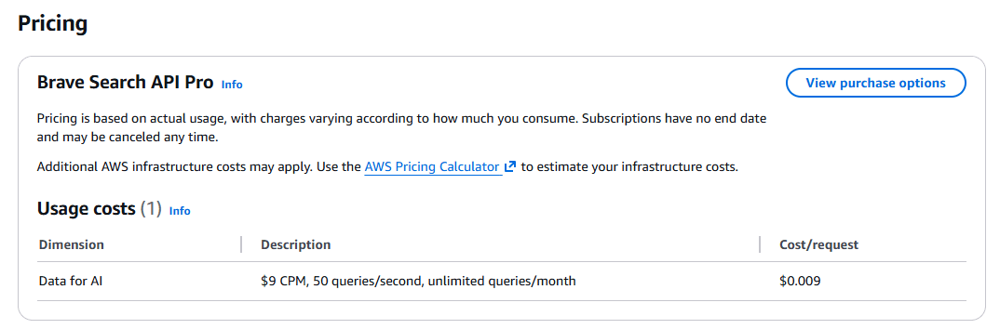

# Research Agent Use Case Deployment Guide

## What is Research Agent

The Research Agent is an advanced research feature using AWS Bedrock AgentCore Runtime. It leverages web search and AWS documentation search to automate information gathering for technical research, business analysis, and problem-solving.

### Key Features

- **Web Search**: Real-time web search using Brave Search API
- **AWS Documentation Search**: Information retrieval from official AWS documentation
- **3 Research Modes**:
  - Technical Research - Detailed technical analysis
  - General Research - Business analysis
  - Mini Research - Quick information retrieval

## Obtaining Brave Search API Key

A Brave Search API key is required to use the Research Agent. By obtaining it through AWS Marketplace, it can be included in your AWS billing, simplifying internal billing processes.

### API Key Acquisition Steps via AWS Marketplace

#### 1. Open AWS Marketplace

Access [AWS Marketplace](https://aws.amazon.com/marketplace).



#### 2. Search for Brave

Enter "Brave" in the search box and search.



#### 3. Select View purchase options

Click the "View purchase options" button on the Brave Search API product page.


#### 4. Execute Subscribe

Click the "Subscribe" button to start the subscription.



#### 5. Launch from Manage Subscriptions

Navigate to the "Manage Subscriptions" page and click the "Launch" button in the Brave row.



#### 6. Setup Account

Click the "Setup Account" button.



#### 7. Obtain API Key

The Brave API key will be displayed. Copy this key and store it securely.



> [!IMPORTANT]
> The API key may only be displayed once. Be sure to save it in a secure location.

## Deployment Configuration

Add the obtained API key to GenU's configuration file.

### Using parameter.ts

Edit `packages/cdk/parameter.ts`:

```typescript
// parameter.ts
const envs: Record<string, Partial<StackInput>> = {
  dev: {
    researchAgentEnabled: true,
    researchAgentBraveApiKey: 'YOUR_BRAVE_API_KEY', // Obtained API key
    researchAgentTavilyApiKey: '', // Optional
  },
};
```

### Using cdk.json

Edit `packages/cdk/cdk.json`:

```json
{
  "context": {
    "researchAgentEnabled": true,
    "researchAgentBraveApiKey": "YOUR_BRAVE_API_KEY",
    "researchAgentTavilyApiKey": ""
  }
}
```

### Execute Deployment

After editing the configuration file, deploy with the following command:

```bash
npm run cdk:deploy
```

Deployment takes approximately 20 minutes. After deployment is complete, the "Research" use case will be displayed on GenU's top page.

For detailed configuration options, refer to [Deploy Options](./DEPLOY_OPTION.md#enabling-research-agent-use-case).

## Brave Pricing

- **9 USD per 1000 web searches**
- **Limit of 50 search requests per second**
- **No monthly limit**

For details, check the [Brave page on Marketplace](https://aws.amazon.com/marketplace/pp/prodview-qjlabherxghtq).



## Reference Links

For detailed procedures and operation verification, refer to the following blog article:

- [Web Search on AWS! Using Brave API from Marketplace](https://zenn.dev/aws_japan/articles/aws-marketplace-brave-api)
